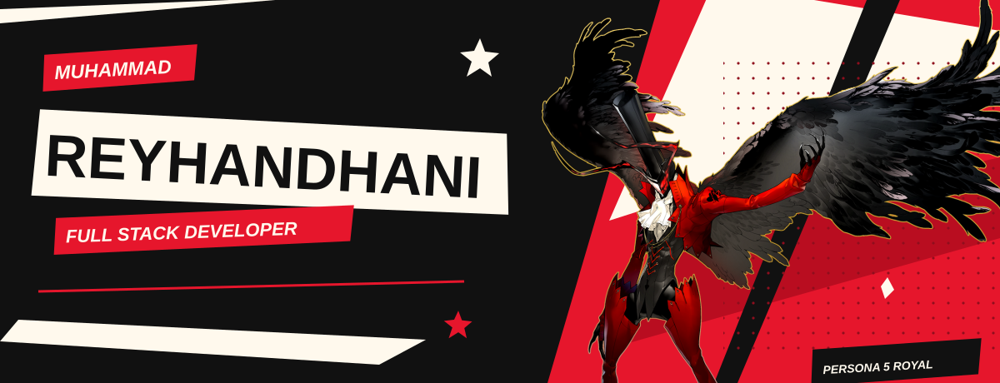

 

 

 

| Layer | Tools |
| :--- | :--- |
| **Languages** |       |
| **Interfaces** |      |
| **Backend & data** |     |
| **Delivery & cloud** |      |
| **Workflow** |     |

 

 
 

 

&nbsp;

 
 

Ars&egrave;ne artwork: &copy; ATLUS / SEGA &middot; <a href="https://p5r.jp/character/hero/">Banner: Persona 5 Royal</a> &middot; <a href="https://p5s.jp/character/hero/">Profile: Persona 5 Strikers</a>

